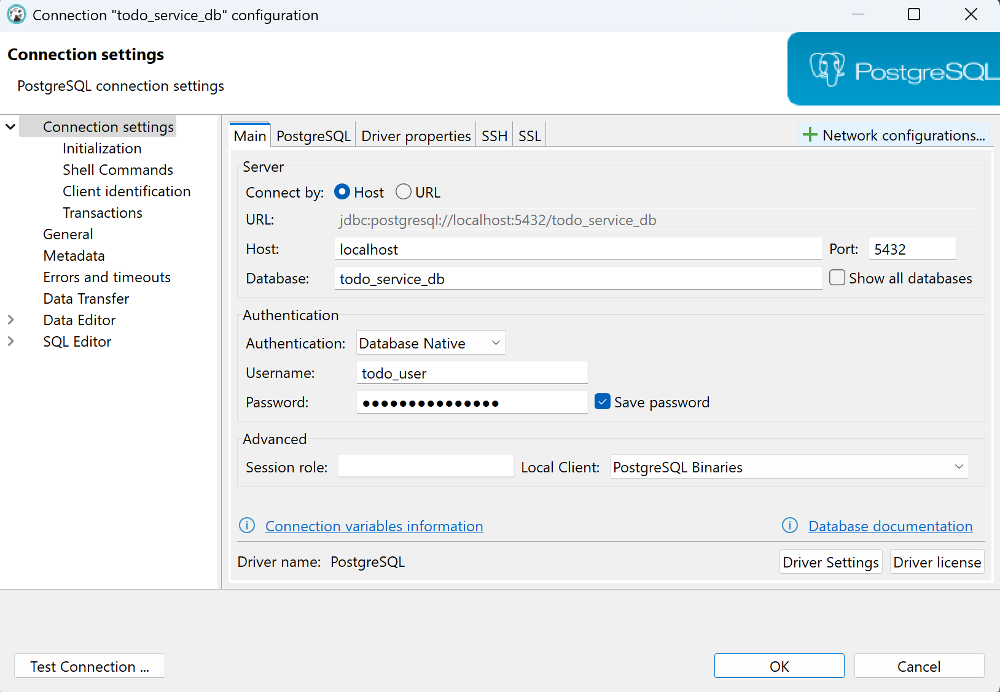
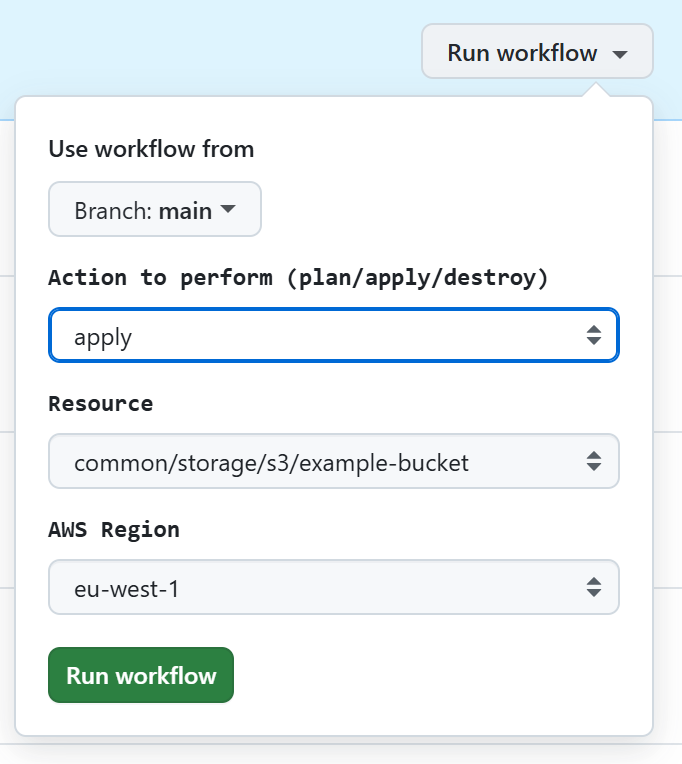
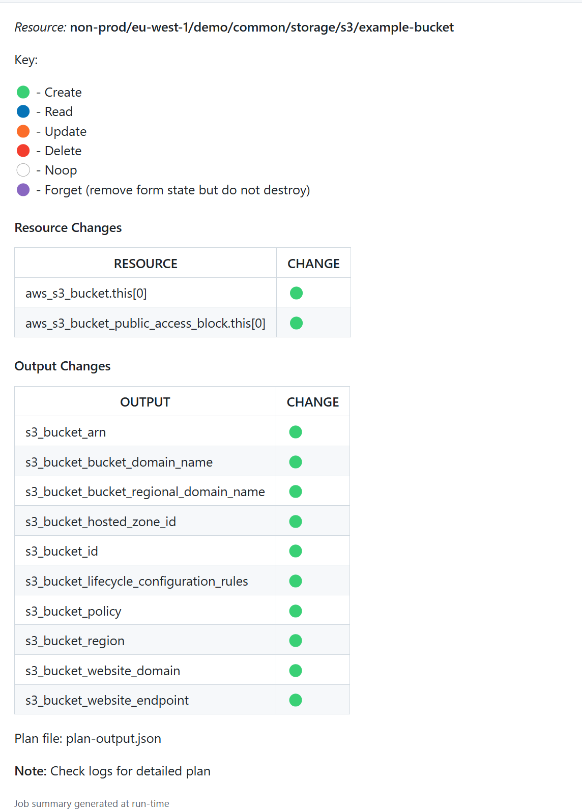
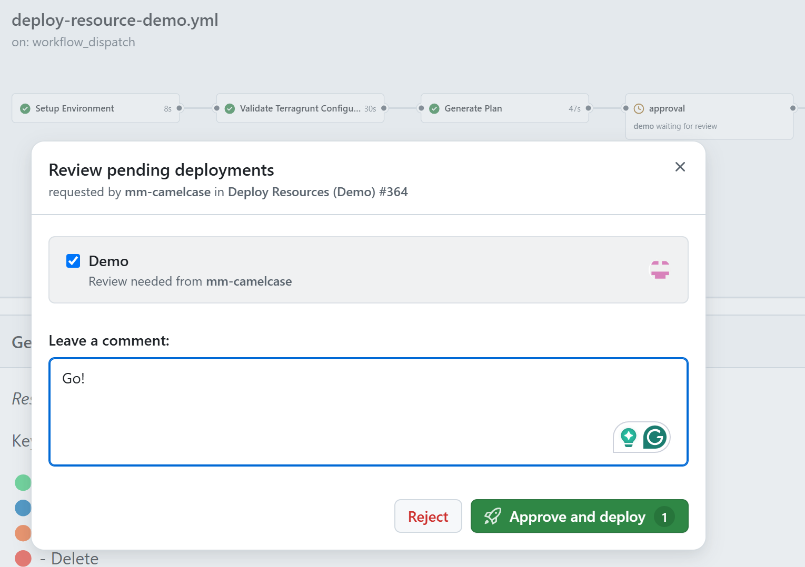

# AWS Infrastructure Demo

## About the Demo Infrastructure
This repository showcases an end-to-end architecture that spans networking, security, services, and the deployment of a static application. The demo infrastructure serves as a complete reference implementation that highlights best practices for building secure, scalable, and well-orchestrated cloud solutions.

## Table of Contents

- [About the Demo Infrastructure](#about-the-demo-infrastructure)
- [Architecture](#architecture)
  - [High-Level Architecture](#high-level-architecture)
  - [Key Features](#key-features)
  - [Application Flow](#application-flow)
- [Domain Configuration](#domain-configuration)
- [Environment Details](#environment-details)
- [Accessing Cloud Resources](#accessing-cloud-resources)
  - [SSM Bastion Usage](#ssm-bastion-usage)
  - [ECS Container Access via exec](#ecs-container-access-via-exec)
- [Workflows](#workflows)
- [Local Setup](#local-setup)
- [FAQ](#faq)


## Architecture

### High-Level Architecture
The overall architecture is depicted in the following diagram:


This diagram represents the services within a VPC connected to public and private subnets, AWS ECS, RDS, and other critical components. 


### Key Features

**1. Networking**  
- **Private & Public Subnets:** Ensures security and scalability.  
- **Load Balancing:** Uses **NLB** for internal services and **CloudFront** for static content delivery.  

**2. Security**  
- **Private Subnets:** Keeps sensitive services and databases inaccessible from the internet.  
- **WAF & API Gateway:** Protects against exploits and secures API access.  
- **OAuth Flow:** Secure authentication using **Keycloak** and OAuth 2.0.  

**3. Access Management**  
- **SSM Bastion:** Secure **AWS SSM-based** access for backend services and databases, eliminating the need for SSH key management.  

**4. Service Architecture**  
- **ECS & ECR:** Services are containerized in **AWS ECS**, with images stored in **ECR**.  
- **Service Discovery:** **AWS Cloud Map** enables dynamic service registration and discovery.  
- **Secrets Management:** Uses **AWS Parameter Store** for secrets and credentials, a **cost-effective alternative** to Secrets Manager.  
- **Logging & Monitoring:** Integrated with **Amazon CloudWatch** for centralized logs.  

**5. Service Security**  
- **Private Networking:** ECS Fargate microservices and **RDS databases** run in private networks.  
- **API Security:** APIs are secured with **OAuth 2.0** for controlled access.  
- **DevOps Access:** Secure **bastion access** for debugging and maintenance.  

**6. Static Application**  
- **Vue-Based App:** Hosted in **S3**, secured with **Keycloak authentication**. See [Application Flow](#application-flow) section.

**7. Automation**  
- **Infrastructure as Code:** Managed with **Terraform/Terragrunt**.  
- **CI/CD:** Automated workflows via **GitHub Actions**.  


### Application Flow

<table>
  <tr>
    <td style="padding: 10px; border: none; vertical-align: top;">
      <ul>
        <li><strong>Hosting & Security:</strong> The Vue.js application is hosted in S3, served via CloudFront, and protected by AWS WAF to mitigate web threats.</li>
        <li><strong>User Authentication:</strong> A Keycloak-based login, implementing OAuth 2.0 Authorization Code Flow.</li>
        <li><strong>Backend Communication:</strong> After authentication, the frontend interacts with a Spring Boot service running on ECS Fargate. API requests are secured using OAuth 2.0, ensuring resource protection and controlled access.</li>
      </ul>
    </td>
    <td style="padding: 10px; border: none; vertical-align: top;">
      
    </td>
  </tr>
</table>


## Domain Configuration

The application and its services are accessible through the following domain setup:

| **Service** | **URL** | **Details** |
|------------|----------------------------|--------------|
| **Frontend (Vue App)** | [app.camelcase.club](https://app.camelcase.club) | The **Vue app** is hosted in **S3** and served via **CloudFront**, protected by by **AWS WAF**  |
| **Authentication (Keycloak)** | [auth.camelcase.club](https://auth.camelcase.club) | Authentication is managed via **Keycloak**  |
| **Backend APIs** | [api.camelcase.club](https://api.camelcase.club) |  Backend **APIs** are exposed at `api.camelcase.club`, secured with **OAuth 2.0**, and protected by by **AWS WAF** |

**Note:** In this demo DNS configuration is managed externally from AWS, with CNAME records pointing to the appropriate AWS resources.
 

## Environments

This walkthrough is based on a **single demo environment**, but the Infrastructure as Code (IaC) setup is designed to support additional environments effortlessly.

- **Scalable IaC Structure:** The Terraform/Terragrunt configuration is modular, making it easy to extend and add new environments as needed.
- **Multi-Account Support:** The infrastructure can be configured to split environments across separate AWS accounts. For example:
  - **Non-prod (Dev & Staging)** in one AWS account.
  - **Production** in a separate AWS account for security and isolation.
- **Terragrunt Compatibility:** The current structure fully supports multi-environment deployments, ensuring streamlined provisioning and consistency across accounts.

## Accessing Cloud Resources

The following table outlines how different resources are accessed across environments:

| **Resource**         | **Access Method**                                    | **Notes** |
|----------------------|------------------------------------------------------|----------|
| **SSM Bastion**      | **AWS Systems Manager Session Manager** (`ssm start-session`) | Secure access to backend services and databases without exposing SSH. |
| **Backend & ECS Services** | Access via **API Gateway** for APIs and **ECS** `exec` for container access | Services are containerized and secured with OAuth 2.0. |
| **Databases**       | Access via **SSM Bastion** with port forwarding       | No direct internet exposure for RDS or other data stores. |


### **SSM Bastion Usage**
To securely connect to backend services or databases, use **AWS SSM Session Manager**:

**Advantages of SSM over SSH:**  
✅ **No open SSH ports** → Eliminates the need for security group rules for SSH.  
✅ **No SSH keys required** → Uses IAM-based authentication.  
✅ **Fully logged & auditable** → All sessions are recorded in AWS CloudTrail.  


#### **Bastion Access**

```bash

ec2_bridge_id=i-008045bbe4f75517b   # EC2 Bastion Id

## Bastian
aws ssm start-session --target $ec2_bridge_id
```


#### **Database Access**

Database access via **SSM Port Forwarding**.

```bash

ec2_bridge_id=i-008045bbe4f75517b   # EC2 Bastion Id
db_url=demo-cc-infra-db.cf2okowc4emp.eu-west-1.rds.amazonaws.com  # DB URL

## PostgreSQL
aws ssm start-session \
    --target $ec2_bridge_id \
    --document-name AWS-StartPortForwardingSessionToRemoteHost \
    --parameters "{\"host\":[\"${db_url}\"],\"portNumber\":[\"5432\"], \"localPortNumber\":[\"5432\"]}"
```

- Update `ec2_bridge_id` and `db_url`
- Connect to database via ``localhost``




### **ECS Container Access via** ``exec``

```bash

ec2_bridge_id=i-008045bbe4f75517b   # EC2 Bastion Id

## service
env=demo
service_name=keycloak-service

task_arn=$(aws ecs list-tasks --cluster "${env}-cc-infra-cluster" --service-name ${env}-cc-infra-${service_name} --query "taskArns[]" --output text)

aws ecs execute-command \
  --cluster "${env}-cc-infra-cluster" \
  --task $task_arn \
  --container $service_name \
  --command "sh" \
  --interactive \
  --region eu-west-1
```

## Workflows


This infrastructure leverages **GitHub Actions** to run **Terraform workflows** securely using **OpenID Connect (OIDC) Identity Provider in AWS**. For detailed information on how OIDC is configured and used, refer to the [OIDC Authentication Guide](https://github.com/mm-camelcase/aws-infra-demo/tree/main/docs/02-github-actions-auth).

### **Terraform Workflows**
Two Terraform workflows are implemented to streamline infrastructure management:

1. **Resource Workflow**:
  - Focused on managing individual Terraform resources, such as S3 buckets or RDS databases.
  - Best suited for making isolated changes or updates to specific components.

<table>
  <tr>
    <th style="padding: 10px; border: none; text-align: left; vertical-align: top;">1. Select action and resource</th>
    <th style="padding: 10px; border: none; text-align: left; vertical-align: top;">2. Review terraform plan</th>
    <th style="padding: 10px; border: none; text-align: left; vertical-align: top;">3. Approve</th>
  </tr>
  <tr>
    <td style="padding: 10px; border: none; vertical-align: top;"></td>
    <td style="padding: 10px; border: none; vertical-align: top;">
      
    </td>
    <td style="padding: 10px; border: none; vertical-align: top;"></td>
  </tr>
</table>  
  

2. **Stack Workflow**:  

  - Manages larger infrastructure stacks or modules, such as VPCs, ECS clusters, or entire environments.
  - Ensures consistency and coordination for complex deployments.

### **Benefits of this Setup**
- **Secure Authentication:** Eliminates the need for long-lived AWS credentials by using OIDC to generate short-lived tokens.
- **Simplified CI/CD:** Seamless integration of GitHub Actions with AWS for automated Terraform runs.
- **Modular Design:** Separate workflows for resources and stacks improve flexibility and scalability.


## **Introduction to Terraform Workflows with GitHub Actions**

This infrastructure leverages **GitHub Actions** to run **Terraform workflows** securely using **OpenID Connect (OIDC) Identity Provider in AWS**. For detailed information on how OIDC is configured and used, refer to the [OIDC Authentication Guide](https://github.com/mm-camelcase/aws-infra-demo/tree/main/docs/02-github-actions-auth).

### **Terraform Workflows**
Two Terragrunt/Terraform workflows are implemented to streamline infrastructure management:

1. **Resource Workflow** (Recomended):
   - Focused on managing individual Terraform resources, such as S3 buckets or RDS databases.
   - Best suited for making isolated changes or updates to specific components.

2. **Stack Workflow** (Exprrimental):
   - Manages larger infrastructure stacks or modules, such as VPCs, ECS clusters, or entire environments.
   - Ensures consistency and coordination for complex deployments.
   - See [Terragrunt Stacks Doc](https://github.com/mm-camelcase/aws-infra-demo/tree/main/docs/03-stacks)


### **Benefits of this Setup**
- **Secure Authentication:** Eliminates the need for long-lived AWS credentials by using OIDC to generate short-lived tokens.
- **Simplified CI/CD:** Seamless integration of GitHub Actions with AWS for automated Terraform runs.
- **Modular Design:** Separate workflows for resources and stacks improve flexibility and scalability.
- **Granular Access Control:** IAM roles ensure each workflow operates with the least privilege necessary.

<table>
  <tr>
    <th style="padding: 10px; border: none; text-align: left; vertical-align: top;">1. Select action and resource</th>
    <th style="padding: 10px; border: none; text-align: left; vertical-align: top;">2. Review terraform plan</th>
    <th style="padding: 10px; border: none; text-align: left; vertical-align: top;">3. Approve</th>
  </tr>
  <tr>
    <td style="padding: 10px; border: none; vertical-align: top;"></td>
    <td style="padding: 10px; border: none; vertical-align: top;">
      
    </td>
    <td style="padding: 10px; border: none; vertical-align: top;"></td>
  </tr>
</table>  

----

## **Introduction to Terraform Workflows with GitHub Actions**

This infrastructure leverages **GitHub Actions** to run **Terraform workflows** securely using **OpenID Connect (OIDC) Identity Provider in AWS**. For detailed information on how OIDC is configured and used, refer to the [OIDC Authentication Guide](https://github.com/mm-camelcase/aws-infra-demo/tree/main/docs/02-github-actions-auth).

### **Terraform Workflows**
Two Terragrunt/Terraform workflows are implemented to streamline infrastructure management:

1. **Resource Workflow** (Recomended):
   - Focused on managing individual Terraform resources, such as S3 buckets or RDS databases.
   - Best suited for making isolated changes or updates to specific components.

2. **Stack Workflow** (Exprrimental):
   - Manages larger infrastructure stacks or modules, such as VPCs, ECS clusters, or entire environments.
   - Ensures consistency and coordination for complex deployments.
   - See [Terragrunt Stacks Doc](https://github.com/mm-camelcase/aws-infra-demo/tree/main/docs/03-stacks)


---

### **Workflow Steps**

Below is a visual representation of the Terraform workflow process:

<table>
  <tr>
    <th style="padding: 10px; border: none; text-align: left; vertical-align: top;"><b>Step 1: Select Action and Resource</b></th>
    <th style="padding: 10px; border: none; text-align: left; vertical-align: top;"><b>Step 2: Review Terraform Plan</b></th>
    <th style="padding: 10px; border: none; text-align: left; vertical-align: top;"><b>Step 3: Approve</b></th>
  </tr>
  <tr>
    <td style="padding: 10px; border: none; vertical-align: top;"></td>
    <td style="padding: 10px; border: none; vertical-align: top;">
      
    </td>
    <td style="padding: 10px; border: none; vertical-align: top;"></td>
  </tr>
</table>  


#### **Step Details**
1. **Select Action and Resource:**
   - The workflow allows users to choose the Terraform action (e.g., `plan`, `apply`, `destroy`) and the specific resource to manage.
   - Regions and modules are selected dynamically via the workflow.

2. **Review Terraform Plan:**
   - After initiating the action, the workflow generates a detailed Terraform plan.
   - Resource changes are clearly displayed, categorized as `Create`, `Update`, `Delete`, etc.

3. **Approve:**
   - The plan requires manual approval before applying any changes to the infrastructure.
   - Approval ensures no accidental changes are applied.

---

### **Benefits of this Setup**
- **Secure Authentication:** Eliminates the need for long-lived AWS credentials by using OIDC to generate short-lived tokens.
- **Simplified CI/CD:** Seamless integration of GitHub Actions with AWS for automated Terraform runs.
- **Controlled Changes:** Manual approval ensures no unintended changes to resources.
- **Granular Access Control:** IAM roles ensure the workflow operates with the least privilege necessary.


-----

env=demo
service_name=keycloak-service

task_arn=$(aws ecs list-tasks --cluster "${env}-cc-infra-cluster" --service-name ${env}-cc-infra-${service_name} --query "taskArns[]" --output text)

aws ecs execute-command \
  --cluster "${env}-cc-infra-cluster" \
  --task $task_arn \
  --container $service_name \
  --command "sh" \
  --interactive \
  --region eu-west-1

# keycloak urls
  https://auth.camelcase.club/realms/demo-realm/.well-known/openid-configuration


# API Tests

## token

curl -X POST "https://auth.camelcase.club/realms/demo-realm/protocol/openid-connect/token" \
     -H "Content-Type: application/x-www-form-urlencoded" \
     -d "client_id=static-app" \
     -d "client_secret=AYyxGdiab7SoxrGCbZO1r2akiWsndDPC" \
     -d "grant_type=password" \
     -d "username=mark@camelcase.email" \
     -d "password=Opt1plex!" \
     -o token.json

## api

curl -X GET "http://localhost:8080/api/users" \
     -H "Authorization: Bearer $(jq -r '.access_token' token.json)" \
     -H "accept: */*"


# DB

```
ec2_bridge_id=i-008045bbe4f75517b   
db_url=demo-cc-infra-db.cf2okowc4emp.eu-west-1.rds.amazonaws.com


## PostgreSQL
aws ssm start-session \
    --target $ec2_bridge_id \
    --document-name AWS-StartPortForwardingSessionToRemoteHost \
    --parameters "{\"host\":[\"${db_url}\"],\"portNumber\":[\"5432\"], \"localPortNumber\":[\"5432\"]}"
```


# login
```
psql -h localhost  -U mm123 -d postgres
```


# create dbs
```
psql -h localhost  -U mm123 -d postgres
```

# create user service db

1. Create the User and Grant Database Access

```
CREATE DATABASE user_service_db;
CREATE USER app_user WITH PASSWORD 'secure-password';
GRANT CONNECT ON DATABASE user_service_db TO app_user;
```

2. Switch to user_service_db

```
\c user_service_db;
```

3. Grant Schema and Table Privileges

```
//GRANT USAGE ON SCHEMA public TO app_user;
//GRANT SELECT, INSERT, UPDATE, DELETE ON ALL TABLES IN SCHEMA public TO app_user;
//ALTER DEFAULT PRIVILEGES IN SCHEMA public GRANT SELECT, INSERT, UPDATE, DELETE ON TABLES TO app_user;
//GRANT USAGE, SELECT ON ALL SEQUENCES IN SCHEMA public TO app_user;

GRANT USAGE, CREATE ON SCHEMA public TO app_user;
GRANT ALL PRIVILEGES ON ALL TABLES IN SCHEMA public TO app_user;
GRANT ALL PRIVILEGES ON ALL SEQUENCES IN SCHEMA public TO app_user;
ALTER DEFAULT PRIVILEGES IN SCHEMA public GRANT ALL ON TABLES TO app_user;
ALTER DEFAULT PRIVILEGES IN SCHEMA public GRANT ALL ON SEQUENCES TO app_user;

```

# create todo service db

1. Create the User and Grant Database Access

```
CREATE DATABASE todo_service_db;
CREATE USER todo_user WITH PASSWORD 'secure-password';
GRANT CONNECT ON DATABASE todo_service_db TO todo_user;
```

2. Switch to todo_service_db

```
\c todo_service_db;
```

3. Grant Schema and Table Privileges

```
//GRANT USAGE ON SCHEMA public TO todo_user;
//GRANT SELECT, INSERT, UPDATE, DELETE ON ALL TABLES IN SCHEMA public TO todo_user;
//ALTER DEFAULT PRIVILEGES IN SCHEMA public GRANT SELECT, INSERT, UPDATE, DELETE ON TABLES TO todo_user;
//GRANT USAGE, SELECT ON ALL SEQUENCES IN SCHEMA public TO todo_user;

GRANT USAGE, CREATE ON SCHEMA public TO todo_user;
GRANT ALL PRIVILEGES ON ALL TABLES IN SCHEMA public TO todo_user;
GRANT ALL PRIVILEGES ON ALL SEQUENCES IN SCHEMA public TO todo_user;
ALTER DEFAULT PRIVILEGES IN SCHEMA public GRANT ALL ON TABLES TO todo_user;
ALTER DEFAULT PRIVILEGES IN SCHEMA public GRANT ALL ON SEQUENCES TO todo_user;

```

# create keycloak db

1. Create the User and Grant Database Access

```
CREATE DATABASE keycloak_db;
CREATE USER keycloak_user WITH PASSWORD 'keycloak-password';
GRANT CONNECT ON DATABASE keycloak_db TO keycloak_user;

```

2. Switch to keycloak_db

```
\c keycloak_db;
```

3. Grant Schema and Table Privileges

```
//GRANT USAGE ON SCHEMA public TO keycloak_user;
//GRANT SELECT, INSERT, UPDATE, DELETE ON ALL TABLES IN SCHEMA public TO keycloak_user;
//ALTER DEFAULT PRIVILEGES IN SCHEMA public GRANT SELECT, INSERT, UPDATE, DELETE ON TABLES TO keycloak_user;
//GRANT USAGE, SELECT ON ALL SEQUENCES IN SCHEMA public TO keycloak_user;

GRANT USAGE, CREATE ON SCHEMA public TO keycloak_user;
GRANT ALL PRIVILEGES ON ALL TABLES IN SCHEMA public TO keycloak_user;
GRANT ALL PRIVILEGES ON ALL SEQUENCES IN SCHEMA public TO keycloak_user;
ALTER DEFAULT PRIVILEGES IN SCHEMA public GRANT ALL ON TABLES TO keycloak_user;
ALTER DEFAULT PRIVILEGES IN SCHEMA public GRANT ALL ON SEQUENCES TO keycloak_user;


```


# Keycloak export

Realm-settings --> Action --> Partial export 

select 
- include groups and roles
- Include clients

# User

Username mark
Email mark@camelcase.email
First name Mark
Last name Mitchell

email verified

role mapping --> api-viewer


=-----

## imprrt

- create raelm (throws error but works)
    name demo-realm & import file


-  create user and assign api-viewer role


## todo 

- add to intro ...a bit abouit tec terraform, ecs app , action workflow etc.
-  links to app and api and keycloak config
-  list cname in details Note: In this demo DNS configuration is managed externally from AWS, with CNAME records pointing to the appropriate AWS resources.

