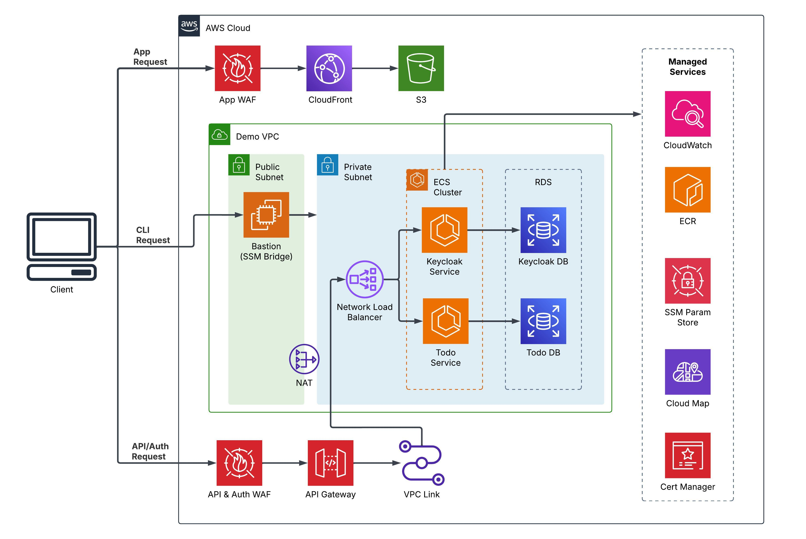

# AWS Infrastructure Demo

## About the Demo Infrastructure
This repository showcases an end-to-end architecture that spans networking, security, services, and the deployment of a static application. The demo infrastructure serves as a complete reference implementation that highlights best practices for building secure, scalable, and well-orchestrated cloud solutions.

## Table of Contents

- [About the Demo Infrastructure](#about-the-demo-infrastructure)
- [Architecture](#architecture)
  - [Key Features](#key-features)
  - [High-Level Architecture](#high-level-architecture)
- [Application Flow](#application-flow)
- [Domain Configuration](#domain-configuration)
- [Environment Details](#environment-details)
- [Accessing Cloud Resources](#accessing-cloud-resources)
- [Workflows](#workflows)
- [Local Setup](#local-setup)
- [FAQ](#faq)


## Architecture

### High-Level Architecture
The overall architecture is depicted in the following diagram:





This diagram represents the services within a VPC connected to public and private subnets, AWS ECS, RDS, and other critical components. 

### Key Features

**1. Networking:**

- Private and public subnets for security and scalability.
- Load Balancing: NLB for internal services, CloudFront for static content.


**2. Security:**

- Private Subnets: Ensures sensitive services and databases remain inaccessible from the public internet.
- WAF & API Gateway: Protect against exploits and secure API access.
- OAuth Flow: Secure user authentication via Keycloak.


**3. Access Management:**

- SSM Bastion Access: Secure CLI access without SSH exposure.

**Static Application:**

- Veu-based app hosted in S3, secured with Keycloak authentication.


**Service Security:**

- ECS Fargate microservices and RDS databases secured in private networks.

**Automation:**

- Terraform/Terragrunt workflows automated via GitHub Actions.

### Application Flow


|       |       |
|-------------------------------------|-------------------------------------|
| <li> **Hosting & Security:** The Vue.js application is hosted in S3, served via CloudFront, and protected by AWS WAF to mitigate web threats.  </li> <li>**User Authentication:** A Keycloak-based login, implementing OAuth 2.0 Authorization Code Flow</li>  <li>**Backend Communication:** After authentication, the frontend interacts with a Spring Boot service running on ECS Fargate. API requests are secured using OAuth 2.0, ensuring resource protection and controlled access. </li> |     |


## Domain Configuration

The application and its services are accessible through the following domain setup:

| **Service** | **URL** |
|------------|----------------------------|
| **Frontend (Vue App)** | [app.camelcase.club](https://app.camelcase.club) |
| **Authentication (Keycloak)** | [auth.camelcase.club](https://auth.camelcase.club) |
| **Backend APIs** | [api.camelcase.club](https://api.camelcase.club) |

### Routing & Security
- The **Vue app** is hosted in **S3** and served via **CloudFront**.
- Authentication is managed via **Keycloak** at `auth.camelcase.club`.
- Backend **APIs** are exposed at `api.camelcase.club`, secured with **OAuth 2.0**.
- The entire setup is protected by **AWS WAF** to mitigate threats.


env=demo
service_name=keycloak-service

task_arn=$(aws ecs list-tasks --cluster "${env}-cc-infra-cluster" --service-name ${env}-cc-infra-${service_name} --query "taskArns[]" --output text)

aws ecs execute-command \
  --cluster "${env}-cc-infra-cluster" \
  --task $task_arn \
  --container $service_name \
  --command "sh" \
  --interactive \
  --region eu-west-1

# keycloak urls
  https://auth.camelcase.club/realms/demo-realm/.well-known/openid-configuration


# API Tests

## token

curl -X POST "https://auth.camelcase.club/realms/demo-realm/protocol/openid-connect/token" \
     -H "Content-Type: application/x-www-form-urlencoded" \
     -d "client_id=static-app" \
     -d "client_secret=AYyxGdiab7SoxrGCbZO1r2akiWsndDPC" \
     -d "grant_type=password" \
     -d "username=mark@camelcase.email" \
     -d "password=Opt1plex!" \
     -o token.json

## api

curl -X GET "http://localhost:8080/api/users" \
     -H "Authorization: Bearer $(jq -r '.access_token' token.json)" \
     -H "accept: */*"


# DB

```
ec2_bridge_id=i-008045bbe4f75517b   
db_url=demo-cc-infra-db.cf2okowc4emp.eu-west-1.rds.amazonaws.com


## PostgreSQL
aws ssm start-session \
    --target $ec2_bridge_id \
    --document-name AWS-StartPortForwardingSessionToRemoteHost \
    --parameters "{\"host\":[\"${db_url}\"],\"portNumber\":[\"5432\"], \"localPortNumber\":[\"5432\"]}"
```


# login
```
psql -h localhost  -U mm123 -d postgres
```


# create dbs
```
psql -h localhost  -U mm123 -d postgres
```

# create user service db

1. Create the User and Grant Database Access

```
CREATE DATABASE user_service_db;
CREATE USER app_user WITH PASSWORD 'secure-password';
GRANT CONNECT ON DATABASE user_service_db TO app_user;
```

2. Switch to user_service_db

```
\c user_service_db;
```

3. Grant Schema and Table Privileges

```
//GRANT USAGE ON SCHEMA public TO app_user;
//GRANT SELECT, INSERT, UPDATE, DELETE ON ALL TABLES IN SCHEMA public TO app_user;
//ALTER DEFAULT PRIVILEGES IN SCHEMA public GRANT SELECT, INSERT, UPDATE, DELETE ON TABLES TO app_user;
//GRANT USAGE, SELECT ON ALL SEQUENCES IN SCHEMA public TO app_user;

GRANT USAGE, CREATE ON SCHEMA public TO app_user;
GRANT ALL PRIVILEGES ON ALL TABLES IN SCHEMA public TO app_user;
GRANT ALL PRIVILEGES ON ALL SEQUENCES IN SCHEMA public TO app_user;
ALTER DEFAULT PRIVILEGES IN SCHEMA public GRANT ALL ON TABLES TO app_user;
ALTER DEFAULT PRIVILEGES IN SCHEMA public GRANT ALL ON SEQUENCES TO app_user;

```

# create todo service db

1. Create the User and Grant Database Access

```
CREATE DATABASE todo_service_db;
CREATE USER todo_user WITH PASSWORD 'secure-password';
GRANT CONNECT ON DATABASE todo_service_db TO todo_user;
```

2. Switch to todo_service_db

```
\c todo_service_db;
```

3. Grant Schema and Table Privileges

```
//GRANT USAGE ON SCHEMA public TO todo_user;
//GRANT SELECT, INSERT, UPDATE, DELETE ON ALL TABLES IN SCHEMA public TO todo_user;
//ALTER DEFAULT PRIVILEGES IN SCHEMA public GRANT SELECT, INSERT, UPDATE, DELETE ON TABLES TO todo_user;
//GRANT USAGE, SELECT ON ALL SEQUENCES IN SCHEMA public TO todo_user;

GRANT USAGE, CREATE ON SCHEMA public TO todo_user;
GRANT ALL PRIVILEGES ON ALL TABLES IN SCHEMA public TO todo_user;
GRANT ALL PRIVILEGES ON ALL SEQUENCES IN SCHEMA public TO todo_user;
ALTER DEFAULT PRIVILEGES IN SCHEMA public GRANT ALL ON TABLES TO todo_user;
ALTER DEFAULT PRIVILEGES IN SCHEMA public GRANT ALL ON SEQUENCES TO todo_user;

```

# create keycloak db

1. Create the User and Grant Database Access

```
CREATE DATABASE keycloak_db;
CREATE USER keycloak_user WITH PASSWORD 'keycloak-password';
GRANT CONNECT ON DATABASE keycloak_db TO keycloak_user;

```

2. Switch to keycloak_db

```
\c keycloak_db;
```

3. Grant Schema and Table Privileges

```
//GRANT USAGE ON SCHEMA public TO keycloak_user;
//GRANT SELECT, INSERT, UPDATE, DELETE ON ALL TABLES IN SCHEMA public TO keycloak_user;
//ALTER DEFAULT PRIVILEGES IN SCHEMA public GRANT SELECT, INSERT, UPDATE, DELETE ON TABLES TO keycloak_user;
//GRANT USAGE, SELECT ON ALL SEQUENCES IN SCHEMA public TO keycloak_user;

GRANT USAGE, CREATE ON SCHEMA public TO keycloak_user;
GRANT ALL PRIVILEGES ON ALL TABLES IN SCHEMA public TO keycloak_user;
GRANT ALL PRIVILEGES ON ALL SEQUENCES IN SCHEMA public TO keycloak_user;
ALTER DEFAULT PRIVILEGES IN SCHEMA public GRANT ALL ON TABLES TO keycloak_user;
ALTER DEFAULT PRIVILEGES IN SCHEMA public GRANT ALL ON SEQUENCES TO keycloak_user;


```


# Keycloak export

Realm-settings --> Action --> Partial export 

select 
- include groups and roles
- Include clients

# User

Username mark
Email mark@camelcase.email
First name Mark
Last name Mitchell

email verified

role mapping --> api-viewer


=-----

## imprrt

- create raelm (throws error but works)
    name demo-realm & import file


-  create user and assign api-viewer role
